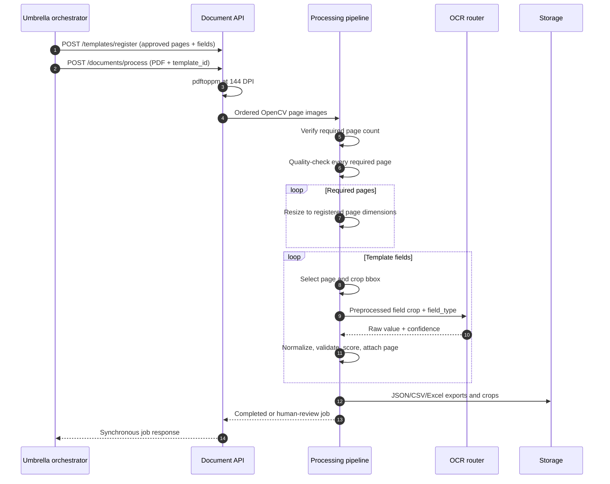

# Document processing architecture

## Scope

The document-processing layer is the runtime executor for an already approved template. Template
discovery, PP-DocLayoutV3 extraction, OCR-label collection, VLM semantic mapping, reviewer edits,
and immutable approval belong to the umbrella registration workflow. Its output is adapted into a
`TemplateDefinition` and registered with this service.

```text
approved umbrella template
        |
        v
POST /api/v1/templates/register
        |
canonical paper-cropped image/PDF + explicit template_id
        |
        v
quality -> canonical page resize -> page ROI crops -> OCR routing -> validation -> exports
```

## Coordinate and page ownership

A template page declares `page_number`, `width`, and `height`. A template field declares a
one-based `page` and an integer pixel `bbox` in that page:

```json
{
  "id": "field_contact_number",
  "page": 2,
  "bbox": {"x": 250, "y": 620, "width": 410, "height": 64}
}
```

The model validates sequential pages, known field-page references, positive box area, and page
bounds during registration. Older single-page definitions may omit `pages` and `field.page`;
they use top-level `width`/`height` and page 1.

The browser editor uses normalized decimal boxes. The umbrella approval boundary—not this
service—multiplies them by the referenced page dimensions and emits bounded integers. This
separation explains why a raw frontend draft is not itself a valid runtime template.

## Multi-page request flow



The highest referenced field page determines how many upload pages are required. Extra PDF pages
are currently ignored by extraction. Missing pages produce a stored `FAILED` job rather than
applying later-page coordinates to the wrong image.

## Pipeline components

| Component | Current responsibility |
|---|---|
| PDF ingestion | Poppler `pdftoppm -png -r 144`, ordered by rendered page number |
| Quality checker | Blur and illumination assessment on every required page |
| Alignment | Public API resizes each page to registered dimensions; internal page-1 reference mode supports ORB/homography |
| Crop engine | Selects the field's page and writes a bounded ROI crop |
| Crop preprocessor | Denoise, contrast/border cleanup, and aspect-ratio preparation |
| OCR router | Printed text via TrOCR; handwriting/table currently reuse TrOCR; checkbox/signature use pixel-density heuristics |
| Validation | Burmese text normalization, required checks, optional regex, combined confidence |
| Exporter | Job JSON plus flattened UTF-8 CSV and Excel files |

## Job state and review

A request is processed synchronously but still produces a job record. Status is:

- `FAILED` for a missing template or insufficient/unreadable pages.
- `HUMAN_REVIEW_REQUIRED` when document quality, field validation, or confidence requires review.
- `COMPLETED` when all checks pass.

Every extracted field retains its `page`, raw and normalized text, OCR/final confidence,
validation result, review flag, and crop path.

## Persistence boundary

`TEMPLATES_REGISTRY` and `JOBS_STORE` are in-memory dictionaries. Crops and exports are files
under persistent storage, but the record indexes disappear on restart. The umbrella orchestrator
therefore owns the durable immutable template version and idempotently re-registers it immediately
before processing a completed document.

A durable downstream registry/job database and durable queue are future production work. Direct
users of this service must currently register templates again after every restart.
