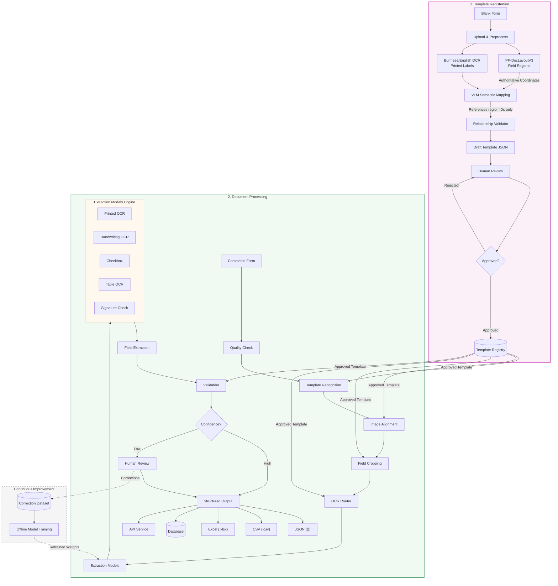

# Burmese Insurance Claim Form OCR System - Architecture Specification

## 1. System Overview

The **Burmese Insurance Claim Form OCR System** is an enterprise-grade document processing pipeline designed to handle complex multilingual (Burmese & English) insurance forms. The system operates on a **Template-Driven Processing Architecture** with integrated Visual Language Models (VLMs), multi-modal OCR extraction engines, Human-in-the-Loop (HITL) validation, and an active Continuous Improvement feedback loop.

---

## 2. Core Architectural Principles

1. **Authoritative Coordinate Ownership (`PP-DocLayoutV3`)**: 
   - `PP-DocLayoutV3` is exclusively responsible for establishing and maintaining bounding box region coordinates for template elements.
2. **Semantic Decoupling via VLM**:
   - Vision-Language Models (VLMs) do not redefine spatial coordinates; instead, they map extracted semantic labels directly to established `PP-DocLayoutV3` Region IDs.
3. **Template Governance**:
   - Only strictly verified and approved templates stored in the **Template Registry** are ingested by the runtime document processing engine.
4. **Adaptive Continuous Learning**:
   - Human review corrections feed into a dedicated dataset pipeline that retrains specialized extraction models offline.

---

## 3. Subsystem Breakdown

### 3.1. Template Registration Module

The Template Registration subsystem processes blank insurance claim forms to define spatial and semantic rules stored as standardized template JSON definitions.

```
[Blank Form] ➔ [Upload & Preprocess]
                     ├──> [PP-DocLayoutV3 (Field Regions)] ────┐
                     └──> [Burmese/English OCR (Labels)] ────┼─> [VLM Semantic Mapping]
                                                              │
[Approved] <── [Approved?] <── [Human Review] <── [Draft JSON] <── [Relationship Validator]
    │               │
    ▼               └──> [Rejected] ──> (Re-review / Edit)
[Template Registry]
```

#### Pipeline Steps:
1. **Blank Form Ingestion & Preprocessing**:
   - Accepts blank form templates (PDF / High-res scans).
   - Applies noise reduction, contrast adjustment, and normalization.
2. **Dual Parallel Extraction**:
   - **PP-DocLayoutV3 (Layout Detection)**: Detects form structural regions, tables, checkboxes, text fields, and signatures, assigning authoritative spatial coordinates.
   - **Burmese / English OCR (Printed Label Recognition)**: Extracts static printed text labels in both Burmese and English scripts.
3. **VLM Semantic Mapping**:
   - Combines layout boundaries and label text.
   - Uses VLM capabilities to map visual/textual labels to target fields using Region IDs.
4. **Relationship Validation**:
   - Validates key-value pairings, table row/column structures, and field hierarchy relationships.
5. **Draft Template Generation**:
   - Outputs a structured `Draft Template JSON` containing region bounds, data types, and semantic relations.
6. **Human Review & Template Approval**:
   - Human reviewers verify draft template accuracy.
   - **Approved**: Saved to the **Template Registry** database.
   - **Rejected**: Returned to draft stage for manual correction.

---

### 3.2. Document Processing Pipeline (Inference Pipeline)

The Document Processing pipeline ingests completed (filled out) insurance claim forms and converts unorganized raster inputs into structured data formats.

```
[Completed Form] ➔ [Quality Check] ➔ [Template Recognition] ➔ [Image Alignment] 
                                                                    │
[Structured Output] <── [Confidence Check] <── [Validation] <── [Field Extraction] <── [OCR Router] <── [Field Cropping]
        ▲                     │                                                             │
        │             (Low)   ▼                                                             ▼
        └────────────── [Human Review]                                               [Extraction Models]
```

#### Pipeline Steps:
1. **Document Ingestion & Quality Assessment**:
   - Ingests filled insurance claim forms.
   - **Quality Check**: Validates resolution, blur level, contrast, illumination, and completeness.
2. **Template Matching (`Template Recognition`)**:
   - Matches the ingested document against active templates in the **Template Registry**.
3. **Image Alignment & Deskewing**:
   - Uses reference landmarks from the recognized template to warp, scale, and align the completed document to baseline template coordinates.
4. **Field Cropping**:
   - Crops specific Regions of Interest (ROIs) according to template field definitions.
5. **OCR Routing & Specialized Model Execution**:
   - The **OCR Router** categorizes field types and routes cropped ROIs to specialized engines:
     - **Printed OCR**: Standard printed Burmese and English text recognition.
     - **Handwriting OCR**: Intelligent Character Recognition (ICR) optimized for handwritten Burmese & Latin scripts.
     - **Checkbox Model**: Binary state classification (checked/unchecked/marked).
     - **Table OCR**: Cell-by-cell matrix extraction for complex claim line items.
     - **Signature Check**: Detection of signature presence, bounding coverage, and stamp verification.
6. **Field Extraction & Rule Validation**:
   - Combines model outputs into structured key-value pairs.
   - Performs rule-based validation against template rules (e.g., regex pattern matching, required fields, data type checks, logical checksums).
7. **Confidence Scoring & HITL Escalation**:
   - **High Confidence**: Proceeds directly to final output generation.
   - **Low Confidence**: Escalates field extraction results to **Human Review** for manual verification.
8. **Structured Data Output**:
   Generates verified records across multiple delivery channels:
   - **JSON** (API payloads)
   - **CSV / Excel** (Batch report generation)
   - **Database** (Transactional claim storage)
   - **API Integration** (Real-time downstream webhooks/microservices)

---

### 3.3. Continuous Improvement Loop

```
[Human Review] ➔ [Correction Dataset] ➔ [Offline Model Training] ➔ [Extraction Models]
```

1. **Correction Data Ingestion**:
   - Corrections made during the Human Review stage (in both Template Registration and Document Processing) are captured as ground-truth pairs.
2. **Correction Dataset Storage**:
   - Maintained in a dedicated versioned dataset repository.
3. **Offline Model Training**:
   - Periodic offline training jobs fine-tune specialized OCR/ICR, table, and handwriting models.
4. **Model Deployment**:
   - Retrained and validated models update the runtime **Extraction Models** pool to increase future extraction accuracy.

---

## 4. Technical Component Summary

| Subsystem Component | Role / Technology | Description |
| :--- | :--- | :--- |
| **PP-DocLayoutV3** | Layout Analysis / Bounding Box Owner | Provides authoritative spatial coordinates for document fields and tables. |
| **Burmese / English OCR** | Static Text Engine | Extracts printed multilingual anchor texts and labels during template setup. |
| **VLM Semantic Mapping** | Vision-Language Model | Performs zero/few-shot semantic association between labels and layout Region IDs. |
| **Template Registry** | Governance Store | Database storing validated draft JSON templates for inference runtime. |
| **Image Alignment** | Warping & Registration | Aligns filled documents to template coordinates via keypoint detection. |
| **OCR Router** | Dynamic Dispatcher | Routes cropped field images to domain-specific extraction engines. |
| **Extraction Models** | Specialized ML Models | - Printed OCR<br>- Handwriting OCR (Burmese & Latin)<br>- Checkbox Detector<br>- Table OCR<br>- Signature Verification |
| **Validation Engine** | Business Logic Validator | Evaluates outputs against regex, data types, required rules, and confidence thresholds. |
| **Correction Dataset** | Data Pipeline | Captures human feedback to create annotated ground-truth datasets. |
| **Offline Model Training** | MLOps / Retraining | Retrains model weights offline for continuous accuracy gains. |

---

## 5. Architectural Diagram (Mermaid Visualization)



---

## 6. System Design Highlights & Takeaways

1. **Multi-Script Capability**: Custom-tailored for Burmese (Myanmar script) and English, supporting complex character segmentation, script-specific OCR, and handwriting recognition.
2. **Robust Quality Control**: Multi-stage validation including initial image quality check, spatial image alignment, business-rule validation, and confidence score thresholds.
3. **Enterprise Integration Ready**: Delivers output across JSON, CSV, Excel, relational databases, and microservice REST/gRPC APIs.
4. **MLOps Best Practices**: Native integration of Human-in-the-Loop review with an automated offline feedback loop for model retraining.
